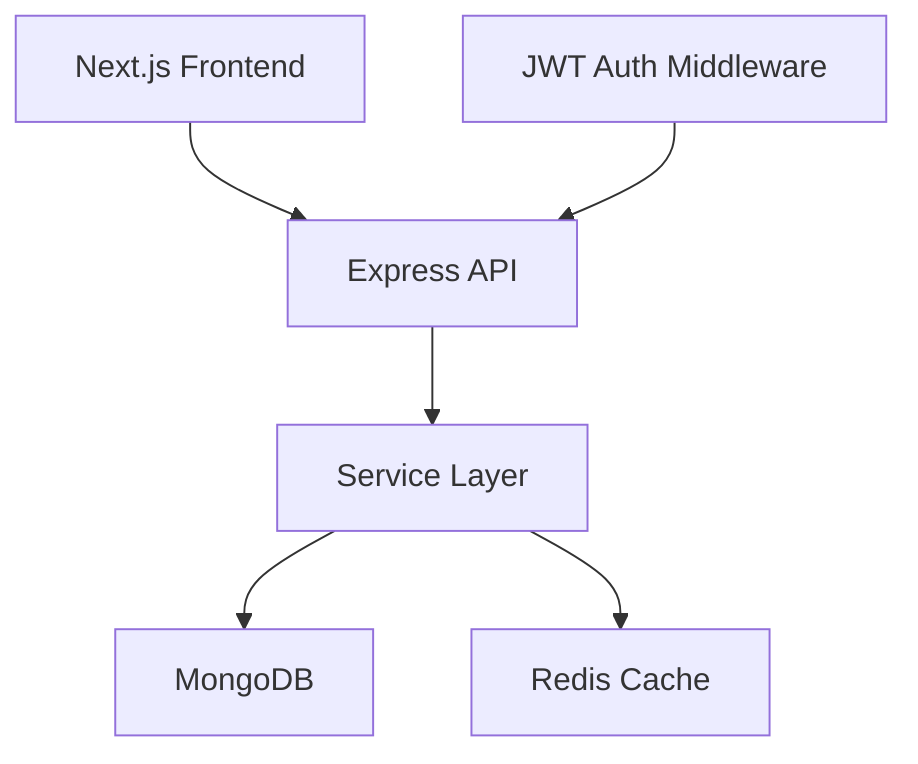

# Delivery Agent Management System

## Overview

This project delivers a full-stack delivery agent management platform with a Next.js frontend, an Express + TypeScript backend, MongoDB persistence, and Redis-backed caching. It includes JWT authentication, role-based access, agent CRUD, filters, pagination, validation, tests, and Docker-based local infrastructure.

## LOCAL DEVELOPMENT

Local development continues to use the existing root Docker Compose setup for MongoDB and Redis.

```bash
git clone <repository-url>
cd delivery-agent-management-system
docker compose up -d

cd backend
npm install
npm run dev

cd ../frontend
npm install
npm run dev
```

The local development stack uses the existing `docker-compose.yml` configuration and keeps MongoDB and Redis available for day-to-day development.

## AWS EC2 PRODUCTION

The production deployment uses a separate Compose file: `docker-compose-prod.yml`.

### Production deployment flow

```bash
git clone <repository>
cd <repository>
nano backend/.env
docker compose -f docker-compose-prod.yml up -d --build
```

Important production details:

- MongoDB remains external via MongoDB Atlas
- Redis runs inside Docker and is reachable as `redis://redis:6379`
- The backend runs in Docker with the compiled app from `npm start`
- The backend health endpoint is `GET /api/health`

See [DEPLOYMENT.md](DEPLOYMENT.md) for the full EC2 setup, security group notes, environment variables, and troubleshooting.

## Features

- JWT authentication and protected routes
- Agent CRUD operations
- MongoDB persistence with Mongoose models
- Redis cache-aside for list and detail reads
- Search, filtering, and pagination
- Admin analytics based on current agent records
- Persisted agent activity history
- Admin CSV export using the active agent filters
- Admin-only create/update/delete access
- Zod validation on input and query params
- Jest + Supertest backend tests
- Docker Compose for local MongoDB and Redis

## Tech Stack

- Frontend: Next.js, React, TypeScript, Tailwind CSS, Axios, React Hook Form, Zod
- Backend: Node.js, Express.js, TypeScript, MongoDB, Mongoose, Redis, JWT, bcrypt
- Testing: Jest, Supertest
- Tooling: Docker Compose, ESLint, Prettier

## Architecture



## Prerequisites

- Node.js 18+
- npm
- Docker
- Docker Compose

## Database setup

MongoDB runs in Docker for local development and persists data in the `delivery_agent_management` database. Configure the development connection string in `backend/.env` using the example file:

```env
MONGODB_URI=mongodb://localhost:27017/delivery_agent_management
```

To seed development data:

```bash
cd backend
npm run seed
```

## Redis setup

The application uses Redis for cache-aside reads of the agent list and individual agent detail responses. By default, the TTL is 60 seconds and keys are deterministic SHA-256 hashes derived from normalized query parameters.

The cache invalidates on create, update, and delete operations. Redis failures are handled gracefully, and the application continues to serve MongoDB-backed data without crashing.

## API documentation

### Authentication

- `POST /api/auth/register`
- `POST /api/auth/login`
- `GET /api/auth/me`

### Agents

- `GET /api/agents`
- `GET /api/agents/export` — admin-only CSV export; accepts the list search, status, and repeated `serviceArea` filters
- `GET /api/agents/:id`
- `GET /api/agents/:id/activity` — admin-only persisted activity history, newest first
- `POST /api/agents`
- `PUT /api/agents/:id`
- `DELETE /api/agents/:id`

### Analytics

- `GET /api/analytics/overview` — admin-only current agent totals, status distribution, and service-area distribution

Analytics reports current MongoDB state only. The application does not have historical snapshots, so it does not report historical trends.

### Health

- `GET /api/health`

## Testing

Run backend tests with:

```bash
cd backend
npm test -- --runInBand
```

A coverage run can be added with:

```bash
cd backend
npx jest --coverage
```

## Notes

- The application uses a practical JWT approach with bearer tokens in the Authorization header.
- The first registered user receives ADMIN privileges for local admin access.
- Passwords are never returned by the API.
